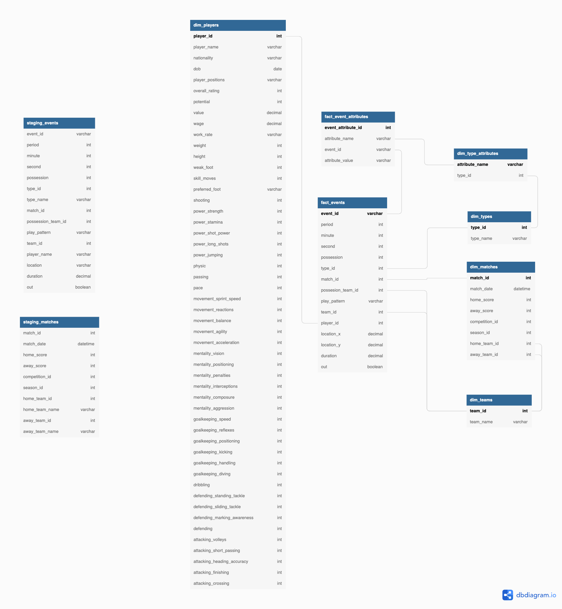

# Football Player Statistics Pipeline

### Udacity Nanodegree Data Engineering Capstone Project

## Project Summary

Goal is to provide information about how players perform during a match, the match outcome and players virtual stats so that those information can be used to analyze players and games in depth.

The project follows the follow steps:

- Step 1: Scope the Project and Gather Data
- Step 2: Explore and Assess the Data
- Step 3: Define the Data Model
- Step 4: Run ETL to Model the Data
- Step 5: Complete Project Write Up

## Dataset

This project works with several different datasets from two sources:

Football Events: https://www.kaggle.com/datasets/saurabhshahane/statsbomb-football-data
Fifa 22: https://www.kaggle.com/datasets/stefanoleone992/fifa-22-complete-player-dataset
Statsbomb provides complete data for all FC Barcelona games of Lionel Messi from 2004 to 2020. The Fifa dataset has all players from Fifa 15 to Fifa 22. The scope of the project is therefore their overlap from August 2014 to June 2020.

### Files and directories

Of the event dataset we are interested in files saved under

- `data/events/*.json`
- `data/matches/11/*.json`

of the Fifa dataset we use the files:

- players\_\*.csv

### Storage

The files need to be saved locally to be processed by the `data_exploration.ipynb` or in my case saved on Google Drive to be accessible through Google Colab. An option would also to save it in an S3 bucket. The total size of the two datasets are ca. 4 GB where the majority is used by the events JSON files Where we will use only a fraction.

## Project Scope

The scope is first to preprocess and clean the data using an iPython Notebook. We then save the cleaned data in an s3 and load it into an Amazon Redshift Data Warehouse.

## Tooling

We use the same tools and concepts that were introduced during the nanodegree

- **iPhython Notebook** with heavy **pandas** usage
- **AWS S3** for file storage
- **Apache Airflow** as data pipeline
- **Amazon Redshift** as Data Warehouse

## Data Model

The data model of the data warehouse is rather a **Snowflake Schema** than a **Star Schema** mainly due to saving the `type_attributes` in a seperate fact table.

- `staging_events` and `staging_matches` are used to COPY from S3 to redshift for further prcoessing
- `dim_players` stores the player information
- `fact_event_attributes` stores the attribute values to each event
- `fact_events` stores the event data occuring during a match
- `dim_type_attributes` stores the event type information of an attribute
- `dim_type` stores the event name
- `dim_matches` stores the match information
- `dim_teams` stores the team name

### Data Dictionary

`staging_matches`

| Field          | Type     | PK  | FK  |
| -------------- | -------- | --- | --- |
| match_id       | int      |
| match_date     | datetime |
| home_score     | int      |
| away_score     | int      |
| competition_id | int      |
| season_id      | int      |
| home_team_id   | int      |
| home_team_name | varchar  |
| away_team_id   | int      |
| away_team_name | varchar  |

`staging_events`

| Field                | Type    | PK  | FK  |
| -------------------- | ------- | --- | --- |
| "event_id"           | varchar |
| "period"             | int     |
| "minute"             | int     |
| "second"             | int     |
| "possession"         | int     |
| "type_id"            | int     |
| "type_name"          | varchar |
| "match_id"           | int     |
| "possession_team_id" | int     |
| "play_pattern"       | varchar |
| "team_id"            | int     |
| "player_name"        | varchar |
| "location"           | varchar |
| "duration"           | decimal |
| "out"                | boolean |

`fact_events`

| Field               | Type    | PK  | FK          |
| ------------------- | ------- | --- | ----------- |
| "event_id"          | varchar | yes |
| "period"            | int     |
| "minute"            | int     |
| "second"            | int     |
| "possession"        | int     |
| "type_id"           | int     |     | dim_types   |
| "match_id"          | int     |     | dim_matches |
| "possesion_team_id" | int     |     | dim_teams   |
| "play_pattern"      | varchar |
| "team_id"           | int     |     | dim_teams   |
| "player_id"         | int     |     | dim_players |
| "location_x"        | decimal |
| "location_y"        | decimal |
| "duration"          | decimal |
| "out"               | boolean |

`dim_matches`

| Field            | Type     | PK  | FK        |
| ---------------- | -------- | --- | --------- |
| "match_id"       | int      | Yes |
| "match_date"     | datetime |
| "home_score"     | int      |
| "away_score"     | int      |
| "competition_id" | int      |
| "season_id"      | int      |
| "home_team_id"   | int      |     | dim_teams |
| "away_team_id"   | int      |     | dim_teams |

`dim_teams`

| Field       | Type    | PK  | FK  |
| ----------- | ------- | --- | --- |
| "team_id"   | int     | Yes |
| "team_name" | varchar |

`dim_types`

| Field       | Type    | PK  | FK  |
| ----------- | ------- | --- | --- |
| "type_id"   | int     | Yes |
| "type_name" | varchar |

`dim_type_attributes`

| Field            | Type    | PK  | FK        |
| ---------------- | ------- | --- | --------- |
| "attribute_name" | varchar | Yes |
| "type_id"        | int     |     | dim_types |

`fact_event_attributes`

| Field                | Type    | PK  | FK        |
| -------------------- | ------- | --- | --------- |
| "event_attribute_id" | int     | Yes |
| "attribute_name"     | varchar |
| "event_id"           | int     |     | dim_event |
| "attribute_value"    | varchar |

`dim_players`

| Field                         | Type    | PK  | FK  |
| ----------------------------- | ------- | --- | --- |
| "player_id"                   | int     | Yes |
| "player_name"                 | varchar |
| "nationality"                 | varchar |
| "dob"                         | date    |
| "player_positions"            | varchar |
| "overall_rating"              | int     |
| "potential"                   | int     |
| "value"                       | decimal |
| "wage"                        | decimal |
| "work_rate"                   | varchar |
| "weight"                      | int     |
| "height"                      | int     |
| "weak_foot"                   | int     |
| "skill_moves"                 | int     |
| "preferred_foot"              | varchar |
| "shooting"                    | int     |
| "power_strength"              | int     |
| "power_stamina"               | int     |
| "power_shot_power"            | int     |
| "power_long_shots"            | int     |
| "power_jumping"               | int     |
| "physic"                      | int     |
| "passing"                     | int     |
| "pace"                        | int     |
| "movement_sprint_speed"       | int     |
| "movement_reactions"          | int     |
| "movement_balance"            | int     |
| "movement_agility"            | int     |
| "movement_acceleration"       | int     |
| "mentality_vision"            | int     |
| "mentality_positioning"       | int     |
| "mentality_penalties"         | int     |
| "mentality_interceptions"     | int     |
| "mentality_composure"         | int     |
| "mentality_aggression"        | int     |
| "goalkeeping_speed"           | int     |
| "goalkeeping_reflexes"        | int     |
| "goalkeeping_positioning"     | int     |
| "goalkeeping_kicking"         | int     |
| "goalkeeping_handling"        | int     |
| "goalkeeping_diving"          | int     |
| "dribbling"                   | int     |
| "defending_standing_tackle"   | int     |
| "defending_sliding_tackle"    | int     |
| "defending_marking_awareness" | int     |
| "defending"                   | int     |
| "attacking_volleys"           | int     |
| "attacking_short_passing"     | int     |
| "attacking_heading_accuracy"  | int     |
| "attacking_finishing"         | int     |
| "attacking_crossing"          | int     |
