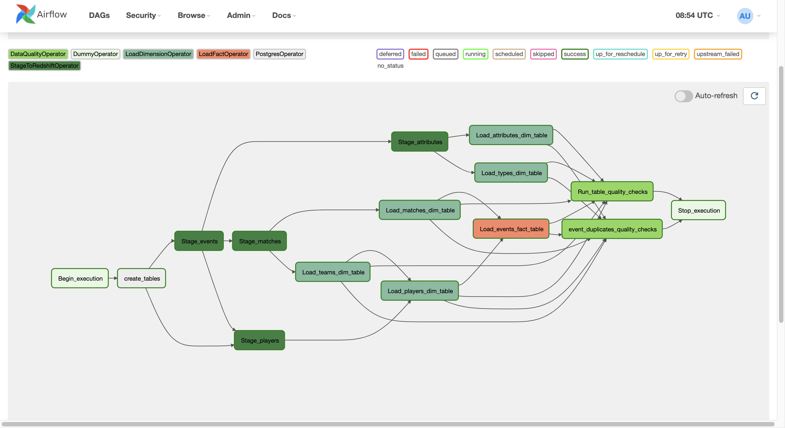
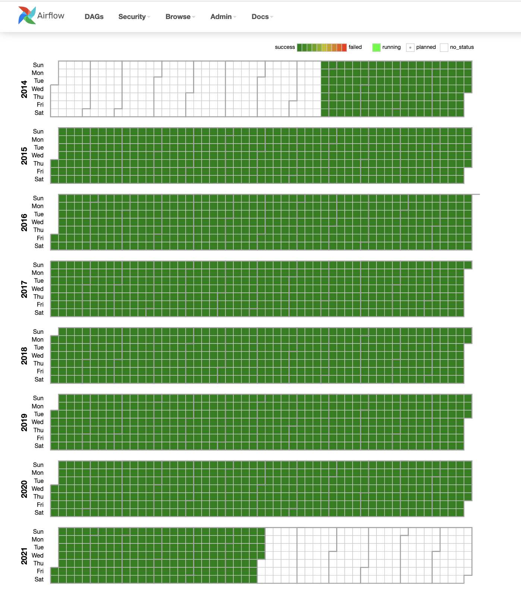
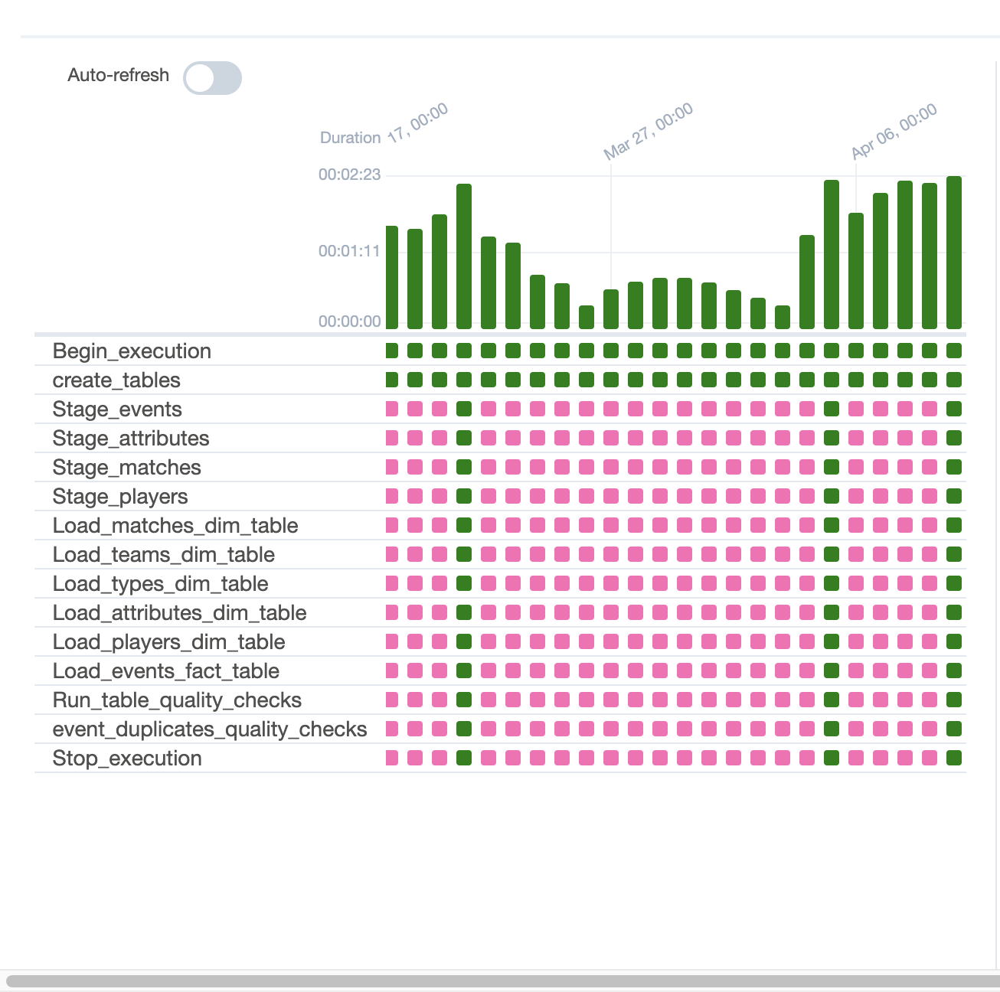

# Football Player Statistics Pipeline

### Udacity Nanodegree Data Engineering Capstone Project

## Project Summary

The goal is to provide information about how players perform during a match, the match outcome and players virtual stats so that those information can be used to analyze players and games in depth.

The project follows the follow steps:

- Step 1: Scope the Project and Gather Data
- Step 2: Explore and Assess the Data
- Step 3: Define the Data Model
- Step 4: Run ETL to Model the Data
- Step 5: Complete Project Write Up

## Dataset

This project works with several different datasets from two sources:

- Football Events: https://www.kaggle.com/datasets/saurabhshahane/statsbomb-football-data
- Fifa 22: https://www.kaggle.com/datasets/stefanoleone992/fifa-22-complete-player-dataset

  Statsbomb provides complete data for all FC Barcelona games of Lionel Messi from 2004 to 2020. The Fifa dataset has all players from Fifa 15 to Fifa 22. The scope of the project is therefore their overlap from August 2014 to June 2020.

### Files and directories

Of the event dataset we are interested in files saved under

- `data/events/*.json`
- `data/matches/11/*.json`

of the Fifa dataset we use the files:

- `players\_\*.csv`

### Storage

The files need to be saved locally to be processed by the `data_exploration.ipynb` or in my case saved on Google Drive to be accessible through Google Colab. An option would also to save it in an S3 bucket. The total size of the two datasets are ca. 4 GB where the majority is used by the events JSON files Where we will use only a fraction.

## Project Scope

The scope is first to preprocess and clean the data using an iPython Notebook. We then save the cleaned data in an s3 and load it into an Amazon Redshift Data Warehouse.

## Tooling

We use the same tools and concepts that were introduced during the nanodegree

- **iPhython Notebook** with heavy **pandas** usage. ipynb is a great way to explore data since you can run code and log the output. You get a good idea of the data you are dealing with without the need to search log files. You can also use it to present it to other stakeholders. For bigger dataset notebooks can also be run in a EMR cluster. For this pandas should be substituded with pyspark.
- **AWS S3** for file storage. S3 is well suited for files of each size and format. It has unlimited scalability, very high durability and very little overhead compared to a solution like HDFS. It can be used as decoupled file system to optimize data processing workflows. It also fullfills the purpose of a data lake holding the cleaned data and can be used for different jobs where a Data Warehouse is not necessary like for example training a machine learning model.
- **Apache Airflow** as data pipeline. Airflow is a free open source tool with a large community providing us with "out of the box" hooks, operators and sensors. Since we partion our data by day its easy to schedule and automate the data processing. Airflow is also highly flexible to adjust the pipeline ffor additional requirements.
- **Amazon Redshift** as Data Warehouse. The distributed architecture of Redshift allows very fast querying in parallel with the same easy integration as any other PostgreSQL database. When the amount of data grows its easy to horizontally scale the infrastructure without the need of maintaining the servers.

## Data Model

The data model of the data warehouse is rather a **Snowflake Schema** than a **Star Schema** mainly due to saving the `type_attributes` in a seperate fact table.

- `staging_events` and `staging_matches` are used to COPY from S3 to redshift for further prcoessing
- `dim_players` stores the player information
- `fact_event_attributes` stores the attribute values to each event
- `fact_events` stores the event data occuring during a match
- `dim_type_attributes` stores the event type information of an attribute
- `dim_type` stores the event name
- `dim_matches` stores the match information
- `dim_teams` stores the team name

### Data Dictionaries

`staging_matches`

| Field          | Type     | PK  | FK  |
| -------------- | -------- | --- | --- |
| match_id       | int      |
| match_date     | datetime |
| home_score     | int      |
| away_score     | int      |
| competition_id | int      |
| season_id      | int      |
| home_team_id   | int      |
| home_team_name | varchar  |
| away_team_id   | int      |
| away_team_name | varchar  |

`staging_events`

| Field              | Type    | PK  | FK  |
| ------------------ | ------- | --- | --- |
| event_id           | varchar |
| period             | int     |
| minute             | int     |
| second             | int     |
| possession         | int     |
| type_id            | int     |
| type_name          | varchar |
| match_id           | int     |
| possession_team_id | int     |
| play_pattern       | varchar |
| team_id            | int     |
| player_name        | varchar |
| location           | varchar |
| duration           | decimal |
| out                | boolean |

`staging_players`

| Field                       | Type    | PK  | FK  |
| --------------------------- | ------- | --- | --- |
| player_id                   | int     | Yes |
| player_name                 | varchar |
| nationality                 | varchar |
| dob                         | date    |
| player_positions            | varchar |
| overall_rating              | int     |
| potential                   | int     |
| value                       | decimal |
| wage                        | decimal |
| work_rate                   | varchar |
| weight                      | int     |
| height                      | int     |
| weak_foot                   | int     |
| skill_moves                 | int     |
| preferred_foot              | varchar |
| shooting                    | int     |
| power_strength              | int     |
| power_stamina               | int     |
| power_shot_power            | int     |
| power_long_shots            | int     |
| power_jumping               | int     |
| physic                      | int     |
| passing                     | int     |
| pace                        | int     |
| movement_sprint_speed       | int     |
| movement_reactions          | int     |
| movement_balance            | int     |
| movement_agility            | int     |
| movement_acceleration       | int     |
| mentality_vision            | int     |
| mentality_positioning       | int     |
| mentality_penalties         | int     |
| mentality_interceptions     | int     |
| mentality_composure         | int     |
| mentality_aggression        | int     |
| goalkeeping_speed           | int     |
| goalkeeping_reflexes        | int     |
| goalkeeping_positioning     | int     |
| goalkeeping_kicking         | int     |
| goalkeeping_handling        | int     |
| goalkeeping_diving          | int     |
| dribbling                   | int     |
| defending_standing_tackle   | int     |
| defending_sliding_tackle    | int     |
| defending_marking_awareness | int     |
| defending                   | int     |
| attacking_volleys           | int     |
| attacking_short_passing     | int     |
| attacking_heading_accuracy  | int     |
| attacking_finishing         | int     |
| attacking_crossing          | int     |

`fact_events`

| Field             | Type    | PK  | FK          |
| ----------------- | ------- | --- | ----------- |
| event_id          | varchar | yes |
| period            | int     |
| minute            | int     |
| second            | int     |
| possession        | int     |
| type_id           | int     |     | dim_types   |
| match_id          | int     |     | dim_matches |
| possesion_team_id | int     |     | dim_teams   |
| play_pattern      | varchar |
| team_id           | int     |     | dim_teams   |
| player_id         | int     |     | dim_players |
| location_x        | decimal |
| location_y        | decimal |
| duration          | decimal |
| out               | boolean |

`dim_matches`

| Field          | Type     | PK  | FK        |
| -------------- | -------- | --- | --------- |
| match_id       | int      | Yes |
| match_date     | datetime |
| home_score     | int      |
| away_score     | int      |
| competition_id | int      |
| season_id      | int      |
| home_team_id   | int      |     | dim_teams |
| away_team_id   | int      |     | dim_teams |

`dim_teams`

| Field     | Type    | PK  | FK  |
| --------- | ------- | --- | --- |
| team_id   | int     | Yes |
| team_name | varchar |

`dim_types`

| Field     | Type    | PK  | FK  |
| --------- | ------- | --- | --- |
| type_id   | int     | Yes |
| type_name | varchar |

`dim_type_attributes`

| Field          | Type    | PK  | FK        |
| -------------- | ------- | --- | --------- |
| attribute_name | varchar | Yes |
| type_id        | int     |     | dim_types |

`fact_event_attributes`

| Field              | Type    | PK  | FK        |
| ------------------ | ------- | --- | --------- |
| event_attribute_id | int     | Yes |
| attribute_name     | varchar |
| event_id           | int     |     | dim_event |
| attribute_value    | varchar |

`dim_players`

| Field                       | Type    | PK  | FK       |
| --------------------------- | ------- | --- | -------- |
| player_id                   | int     | Yes |
| player_name                 | varchar |
| team_id                     | varchar       | dim_team |
| nationality                 | varchar |
| dob                         | date    |
| player_positions            | varchar |
| overall_rating              | int     |
| potential                   | int     |
| value                       | decimal |
| wage                        | decimal |
| work_rate                   | varchar |
| weight                      | int     |
| height                      | int     |
| weak_foot                   | int     |
| skill_moves                 | int     |
| preferred_foot              | varchar |
| shooting                    | int     |
| power_strength              | int     |
| power_stamina               | int     |
| power_shot_power            | int     |
| power_long_shots            | int     |
| power_jumping               | int     |
| physic                      | int     |
| passing                     | int     |
| pace                        | int     |
| movement_sprint_speed       | int     |
| movement_reactions          | int     |
| movement_balance            | int     |
| movement_agility            | int     |
| movement_acceleration       | int     |
| mentality_vision            | int     |
| mentality_positioning       | int     |
| mentality_penalties         | int     |
| mentality_interceptions     | int     |
| mentality_composure         | int     |
| mentality_aggression        | int     |
| goalkeeping_speed           | int     |
| goalkeeping_reflexes        | int     |
| goalkeeping_positioning     | int     |
| goalkeeping_kicking         | int     |
| goalkeeping_handling        | int     |
| goalkeeping_diving          | int     |
| dribbling                   | int     |
| defending_standing_tackle   | int     |
| defending_sliding_tackle    | int     |
| defending_marking_awareness | int     |
| defending                   | int     |
| attacking_volleys           | int     |
| attacking_short_passing     | int     |
| attacking_heading_accuracy  | int     |
| attacking_finishing         | int     |
| attacking_crossing          | int     |

## Data Pipeline

The data pipeline is implemented using **Apache Airflow**. We basically have 4 stages: create tables, stage data, transform plus load data and quality checks. The pipeline is set to run every day and load the match of this specific day. In case no match happened it skips all other tasks for this day

- `create_tables` makes sure that all tables listed above exist in the data warehouse
- `stage_events` loads the events for the specific day into staging table
- `stage_attributes` loads the attributes of the event for the specific day into fact table
- `stage_matches` loads matches into staging table
- `stage_players` loads all players into dimension table
- `load_attributes_dim_table` loads attributes into dimension table
- `load_types_dim_table` loads types into dimension table
- `load_matches_dim_table` loads matches into dimension table
- `load_events_fact_table` loads events into fact table
- `load_teams_dim_table` loads teams into dimension table
- `run_table_quality_checks` runs a given number of quality assuring queries on a given number of tables. Currently it checks if any table might be empty
- `event_duplicates_quality_checks` checks if an event might be saved more than once in the fact table

### Airflow Calendar

### Airflow Duration

### Airflow Grid

## Scenarios

**The data was increased by 100x**
This is a very likely case since we only look at the games of FC Barcelona. Looking at all games of all major leagues in europe would increase the data size easily 100x. In this case the exploration and data cleansing notebook might needs to run with Spark on a EMR cluster. Some of the fine tuning like looking at individual player names would be most likely not possible anymore. The Data Warehouse probably needs to grow vertically with additional nodes to run the queries during the data pipeline.

**The pipelines would be run on a daily basis by 7 am every day.**
This is what the pipeline is designed for and should work fine. The only challenge would be to make sure that match data from a couple of days ago are taken into account.

**The database needed to be accessed by 100+ people**
Depending on the load those 100+ people would but on the warehouse might need to be up scaling necessary.
